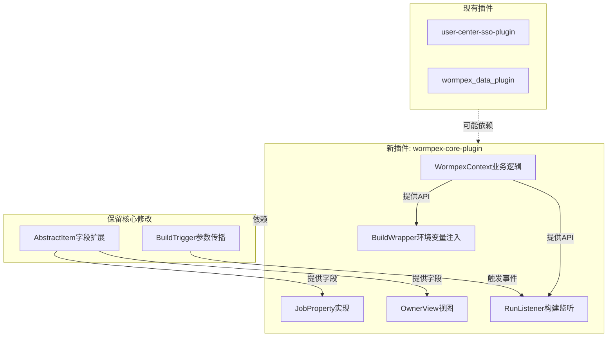

# Jenkins 定制内容分析与插件化方案

## 一、已完成的调研发现

### 1.1 定制版本的核心修改内容

通过对比分析，定制版在以下方面进行了修改：

#### 核心类修改（7个文件）

- [`hudson/model/AbstractItem.java`](../../github/jenkins-github/core/src/main/java/hudson/model/AbstractItem.java) - 新增4个字段：ownerName、contacts、lineOfBusiness、proxyUser
- [`hudson/model/AbstractProject.java`](../../github/jenkins-github/core/src/main/java/hudson/model/AbstractProject.java) - 新增业务线下拉框和校验方法
- [`hudson/model/Run.java`](../../github/jenkins-github/core/src/main/java/hudson/model/Run.java) - 在execute()中集成WormpexContext
- [`hudson/tasks/Shell.java`](../../github/jenkins-github/core/src/main/java/hudson/tasks/Shell.java) - 注入HADOOP_USER_NAME环境变量
- [`hudson/tasks/BuildTrigger.java`](../../github/jenkins-github/core/src/main/java/hudson/tasks/BuildTrigger.java) - 增强上游触发参数传播
- [`jenkins/model/ParameterizedJobMixIn.java`](../../github/jenkins-github/core/src/main/java/jenkins/model/ParameterizedJobMixIn.java) - 单次构建支持
- [`hudson/model/ParametersDefinitionProperty.java`](../../github/jenkins-github/core/src/main/java/hudson/model/ParametersDefinitionProperty.java) - 参数解析增强

#### 新增业务包（6个类）

- `wormpex.data.WormpexContext` - 核心上下文管理类（使用Guava Cache）
- `wormpex.data.util.ProxyUser` - 代理用户实体
- `wormpex.data.util.ProxyUserQueue` - 代理用户队列
- `wormpex.data.util.Pair` - 键值对工具类
- `wormpex.data.util.LockLinkedHashSet` - 线程安全集合
- `wormpex.data.util.UpstreamTriggerChain` - 上游触发链

#### 新增视图类

- `hudson.model.OwnerView` - 基于所有者的项目过滤视图

#### UI层修改

- [`Job/configure.jelly`](../../github/jenkins-github/core/src/main/resources/hudson/model/Job/configure.jelly) - 新增lineOfBusiness、ownerName、contacts字段

#### 依赖变更

- 新增fastjson依赖（1.2.8.sec10_noneautotype）

### 1.2 官方版本对照

- 官方Jenkins 2.541.2（stable-2.541分支）不包含任何wormpex相关代码
- 不包含fastjson依赖
- 核心类保持原始状态

## 二、插件化可行性分析

### 2.1 可完全插件化的功能（优先级：高）

#### A. OwnerView视图

- **技术方案**：View扩展点
- **实现难度**：★☆☆☆☆（简单）
- **依赖**：依赖AbstractItem的ownerName字段
- **说明**：已经使用@Extension注解，可直接迁移到插件

#### B. Wormpex业务逻辑层

- **技术方案**：独立Java包
- **实现难度**：★★☆☆☆（中等）
- **包含内容**：WormpexContext及其所有工具类
- **说明**：可以作为插件的核心业务层，提供API给其他扩展点使用

#### C. 项目元数据字段（部分可插件化）

- **技术方案**：JobProperty扩展点
- **实现难度**：★★★☆☆（中等偏高）
- **字段**：ownerName、contacts、lineOfBusiness
- **说明**：可以通过JobProperty实现，但需要调整访问方式

### 2.2 需要保留核心修改的功能（优先级：评估）

#### A. AbstractItem字段扩展

- **问题**：如果使用JobProperty，其他核心代码（如OwnerView）访问这些字段会变复杂
- **建议**：评估是否可以通过插件API桥接访问
- **影响范围**：ownerName、contacts、lineOfBusiness、proxyUser字段

#### B. Run.java的execute()修改

- **问题**：构建执行时注入proxyUser
- **替代方案**：可以使用RunListener或者BuildWrapper
- **实现难度**：★★★☆☆（中等偏高）
- **说明**：需要验证时机是否合适

#### C. Shell.java的环境变量注入

- **问题**：在Shell脚本中注入HADOOP_USER_NAME
- **替代方案**：使用BuildWrapper的Environment或者EnvironmentContributor
- **实现难度**：★★★★☆（较高）
- **说明**：需要确保注入时机正确

#### D. BuildTrigger参数传播

- **问题**：上游触发时传播参数和认证上下文
- **替代方案**：较难，可能需要保留核心修改或使用复杂的Listener组合
- **实现难度**：★★★★★（很高）
- **说明**：这是最难插件化的部分

#### E. 单次构建功能

- **问题**：ParameterizedJobMixIn和ParametersDefinitionProperty的修改
- **替代方案**：可以通过Action和TransientActionFactory实现
- **实现难度**：★★★☆☆（中等偏高）

### 2.3 推荐的混合方案



## 三、实施计划

### 3.1 差异对比（详细代码级别）

**目标**：生成完整的差异报告

**方法**：

1. 对比核心类的具体修改内容（逐行diff）
2. 提取所有Jelly模板的变更
3. 对比pom.xml依赖差异
4. 生成结构化的差异清单

**输出文件**：（暂不创建，仅在内存中分析）

### 3.2 创建新插件模块：wormpex-core-plugin

**位置**：[`/Users/zhangxuan/Documents/wormpex/code-project/data/jenkins-plugins/wormpex-core-plugin`](../../data/jenkins-plugins/)

**模块结构**：

```
wormpex-core-plugin/
├── pom.xml
├── src/
│   └── main/
│       ├── java/
│       │   └── com/wormpex/jenkins/
│       │       ├── context/
│       │       │   ├── WormpexContext.java
│       │       │   └── util/ (所有工具类)
│       │       ├── property/
│       │       │   └── WormpexJobProperty.java
│       │       ├── view/
│       │       │   └── OwnerView.java
│       │       ├── wrapper/
│       │       │   └── ProxyUserBuildWrapper.java
│       │       └── listener/
│       │           └── ProxyUserRunListener.java
│       └── resources/
│           └── com/wormpex/jenkins/
│               └── (Jelly模板)
└── README.md
```

**核心功能**：

1. **WormpexContext迁移**：将wormpex.data包完整迁移到插件
2. **JobProperty**：实现项目元数据字段的存储和访问
3. **OwnerView**：迁移所有者视图
4. **BuildWrapper**：实现环境变量注入（替代Shell.java修改）
5. **RunListener**：实现构建前的proxyUser设置（替代Run.java修改）

### 3.3 评估文档生成

**内容**：

- 插件化成功率评估（预计70-80%可插件化）
- 必须保留的核心修改清单及原因
- 后续升级指南（如何处理核心修改）
- 风险评估和测试建议

## 四、技术实现细节

### 4.1 JobProperty实现元数据字段

```java
public class WormpexJobProperty extends JobProperty<Job<?, ?>> {
    private String ownerName;
    private String contacts;
    private String lineOfBusiness;
    private String proxyUser;
    
    // Getters/Setters + Descriptor
}
```

**访问方式变更**：

- 原来：`job.getOwnerName()`
- 插件后：`job.getProperty(WormpexJobProperty.class).getOwnerName()`

**影响**：需要修改OwnerView的字段访问逻辑

### 4.2 BuildWrapper实现环境变量注入

```java
public class ProxyUserBuildWrapper extends SimpleBuildWrapper {
    @Override
    public void setUp(Context context, Run<?, ?> build, ...) {
        Job job = build.getParent();
        WormpexJobProperty prop = job.getProperty(WormpexJobProperty.class);
        String proxyUser = WormpexContext.getProxyUserforBizCode(prop.getLineOfBusiness());
        context.env("HADOOP_USER_NAME", proxyUser);
    }
}
```

**替代**：Shell.java的buildwithProxyUser()方法

### 4.3 RunListener实现构建前设置

```java
@Extension
public class ProxyUserRunListener extends RunListener<Run<?, ?>> {
    @Override
    public void onStarted(Run<?, ?> run, TaskListener listener) {
        Job job = run.getParent();
        WormpexJobProperty prop = job.getProperty(WormpexJobProperty.class);
        String proxyUser = WormpexContext.getProxyUserforBizCode(prop.getLineOfBusiness());
        prop.setProxyUser(proxyUser);
    }
}
```

**替代**：Run.java的execute()方法中的逻辑

## 五、无法插件化的核心修改（需保留）

### 5.1 AbstractItem字段扩展

- **保留原因**：JobProperty访问较复杂，影响现有代码兼容性
- **建议**：继续维护核心修改，通过文档记录差异
- **升级策略**：每次Jenkins升级时手动合并这部分代码

### 5.2 BuildTrigger参数传播

- **保留原因**：插件化成本极高，涉及Jenkins核心触发机制
- **建议**：保留shouldWormpexTrigger()方法
- **升级策略**：标记为关键修改，升级时优先测试

### 5.3 单次构建功能（可选）

- **评估结果**：可插件化但成本较高
- **建议**：先评估业务必要性，如不常用可考虑移除

## 六、成果交付

### 6.1 新插件模块

- wormpex-core-plugin完整代码
- 包含单元测试和集成测试
- 完整的README和使用文档

### 6.2 升级指南文档（口头说明，不写文件）

- 插件化后的配置变更说明
- 保留核心修改的清单及位置
- 后续Jenkins版本升级的合并策略
- 测试验证清单

### 6.3 对比分析（口头说明，不写文件）

- 详细的代码差异对比
- 插件化可行性评估
- 技术决策说明

## 七、风险与建议

### 7.1 风险

- JobProperty访问方式变更可能影响性能
- 某些时机依赖的功能可能需要额外测试
- 插件间依赖关系需要明确管理

### 7.2 建议

- 分阶段实施：先迁移简单的（OwnerView、WormpexContext）
- 充分测试：特别是代理用户注入和参数传播功能
- 保持向后兼容：考虑是否需要支持老配置的迁移

### 7.3 后续优化方向

- 考虑将WormpexContext的配置外部化（不使用硬编码）
- 评估是否可以使用Jenkins的Configuration as Code插件
- 为fastjson依赖考虑替代方案（Jenkins社区推荐使用Jackson）